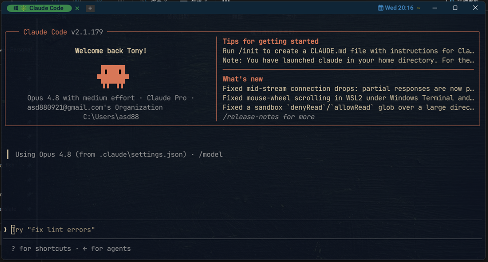

# WezTerm 主題設定

我的個人 [WezTerm](https://wezfurlong.org/wezterm/) 設定與主題。



## 安裝步驟

### 1. Clone 到設定資料夾

WezTerm 的設定檔要直接放在 `wezterm` 資料夾底下，所以請先 clone 到 `.config`，再把專案資料夾改名成 `wezterm`。

請將 `<user-name>` 換成你自己的 Windows 使用者名稱：

```powershell
cd C:\Users\<user-name>\.config
git clone https://github.com/asd880921/wezterm.git
```

clone 完成後，最終路徑要是：

```
C:\Users\<user-name>\.config\wezterm
```

> 如果 clone 下來的資料夾名稱不是 `wezterm`，請手動改名成 `wezterm`。

### 2. 安裝字體

打開 `ttf` 資料夾，安裝裡面的兩個字體（對字體檔案按右鍵 → 安裝）：

- `JetBrainsMonoNerdFont-Regular.ttf`
- `MesloLGMNerdFont-Regular.ttf`

### 3. 開啟 WezTerm

完成以上步驟後，開啟（或重新啟動）WezTerm 即可套用主題。
