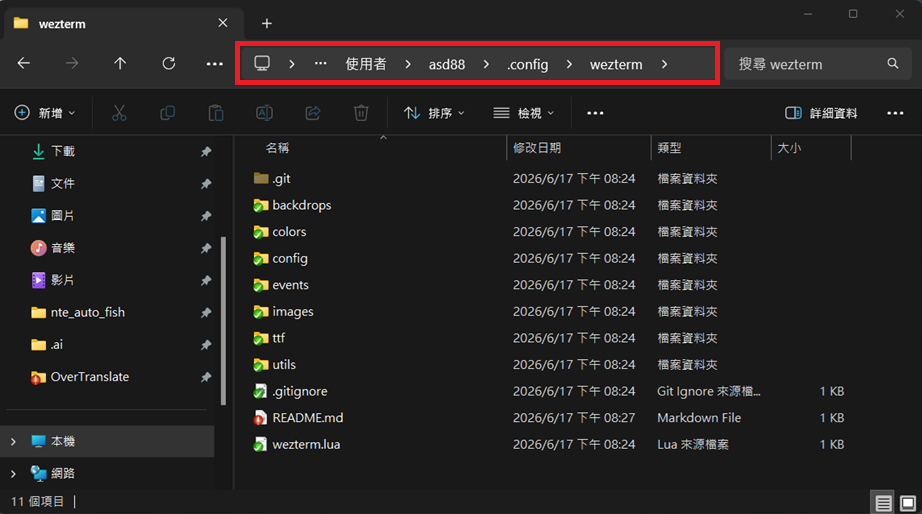
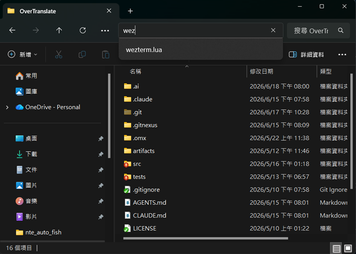

# WezTerm 主題設定

我的個人 [WezTerm](https://wezfurlong.org/wezterm/) 設定與主題。

## 安裝步驟

### 1. 將主題安裝至 WezTerm

- 開啟 `C:\Users\<user-name>\.config` 資料夾後，將專案直接 clone 到該路徑下 (或是直接下載專案然後解壓縮至該資料夾)。

- 將 clone 或 下載的專案資料夾名稱從 `wezterm-config` 更改為 `wezterm`

### 2. 安裝字體

打開 `assets` 資料夾，安裝裡面的兩個字體（對字體檔案按右鍵 → 安裝）：

- `JetBrainsMonoNerdFont-Regular.ttf`
- `MesloLGMNerdFont-Regular.ttf`

### 3. 開啟 WezTerm

完成以上步驟後，開啟（或重新啟動）WezTerm 即可套用主題。

### 補充

想在任意資料夾直接開啟 WezTerm 視窗，可將 `assets` 內的 `wez.bat` 複製到 `C:\Program Files\WezTerm`，之後在該路徑輸入 `wez` 即可開啟。
